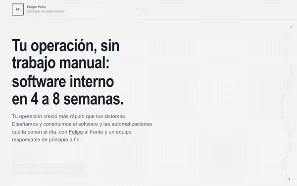
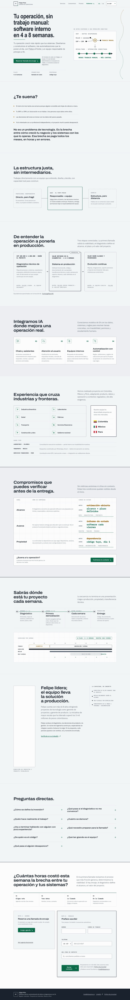
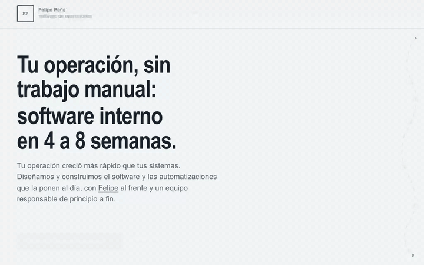
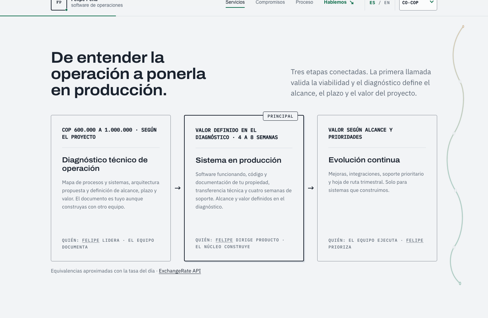
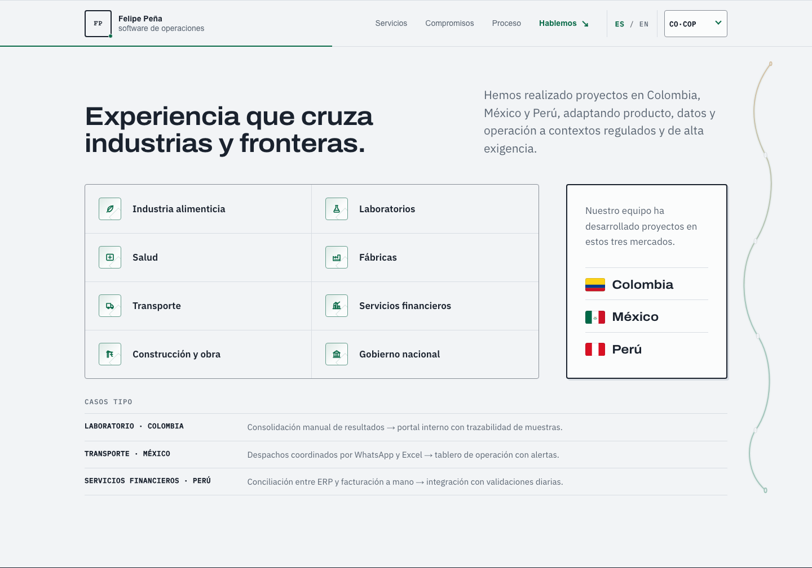
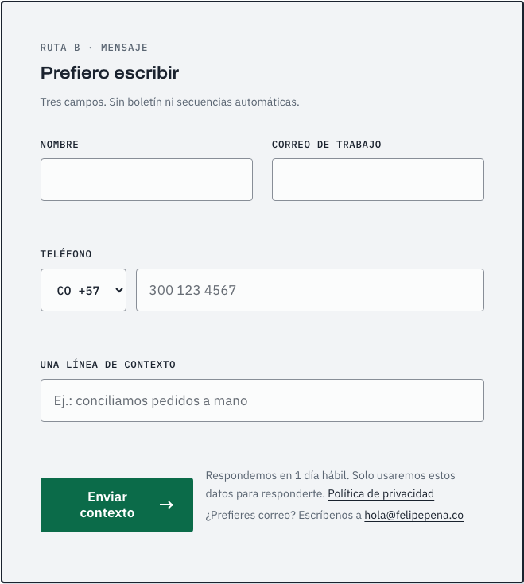

**Esta landing convierte una operación B2B fragmentada en una conversación clara sobre software interno, automatización y entrega en producción.**

<div align="center">
  

  <h1>Felipe Peña · Software de operaciones</h1>
  <p><strong>Una landing para explicar el problema, mostrar una oferta verificable y llevar al prospecto al siguiente paso sin fricción.</strong></p>

  <p>
    <a href="https://consultoria.felipepena.co"></a>
  </p>
  <p>
    
    
    
    
    <a href="https://github.com/castellanosfelipe/felipe-pena-landing/actions/workflows/ci.yml"></a>
  </p>
</div>

## 📋 Tabla de Contenidos

- [¿Qué es este proyecto?](#-qué-es-este-proyecto)
- [Demo en vivo](#-demo-en-vivo)
- [Características principales](#-características-principales)
- [Capturas y video](#-capturas-y-video)
- [Instalación rápida](#-instalación-rápida)
- [Cómo usar](#-cómo-usar)
- [Arquitectura](#️-arquitectura)
- [Despliegue y dominios](#-despliegue-y-dominios)
- [Roadmap](#️-roadmap)
- [Contribuir](#-contribuir)
- [Licencia](#-licencia)

## 🎯 ¿Qué es este proyecto?

Es la landing comercial de Felipe Peña para empresas cuya operación creció más rápido que sus sistemas. Presenta una oferta de software interno y automatización de datos con alcance, forma de trabajo y compromisos visibles antes de pedir una conversación. Está en producción en **[consultoria.felipepena.co](https://consultoria.felipepena.co)**.

### El problema que resuelve

Muchas operaciones B2B dependen de hojas de cálculo, correos y copias manuales entre sistemas. El prospecto sabe que pierde tiempo y confiabilidad, pero no siempre puede convertir ese dolor en un proyecto entendible y comprable.

### La solución

La página transforma ese problema en un recorrido concreto: identifica síntomas, explica la alternativa, muestra servicios y condiciones, responde objeciones y ofrece un contacto breve. El contenido evita casos o métricas no autorizados y usa compromisos que el cliente sí puede verificar.

### ¿Para quién es?

| Audiencia                          | Beneficio clave                                                                                          |
| ---------------------------------- | -------------------------------------------------------------------------------------------------------- |
| Líderes de operaciones B2B         | Reconocen rápidamente si sus procesos manuales encajan con la oferta.                                    |
| Responsables de tecnología y datos | Entienden propiedad, arquitectura, ritmo de demos y entrega sin pasar primero por una llamada comercial. |
| Stakeholders de negocio            | Entienden el costo del diagnóstico, el plazo y cómo se define el valor del proyecto antes de construir.  |

## 🎬 Demo en vivo

[](https://consultoria.felipepena.co)

<div align="center">
  
  <p><em>Recorrido completo: del problema operativo a la oferta, el proceso y el contacto.</em></p>
</div>

- **Producción:** [`consultoria.felipepena.co`](https://consultoria.felipepena.co) — build estático de Astro servido en Vercel, con HTTPS, `PUBLIC_SITE_URL` canónico, `sitemap.xml`, `robots.txt` y página 404 propia.
- **Bilingüe:** versión en inglés en [`/en/`](https://consultoria.felipepena.co/en/).
- **Calidad automatizada en CI:** cada push corre `astro check`, auditoría de dependencias, validadores de artefacto (HTML, SEO, formulario, rutas, recursos y presupuesto de peso) y Lighthouse CI (Performance/Accessibility/Best Practices/SEO ≥ 95, con LCP y CLS bajo presupuesto).

## ✨ Características principales

| Feature                                   | Descripción                                                                                        |
| ----------------------------------------- | -------------------------------------------------------------------------------------------------- |
| 🎯 **Narrativa orientada al problema**    | Lleva al visitante desde síntomas reconocibles hasta una oferta y un siguiente paso concretos.     |
| 💵 **Ruta comercial clara**               | Explica la validación de viabilidad, el diagnóstico, los plazos y la propiedad del código.          |
| 🌎 **País y moneda persistentes**          | Convierte únicamente el diagnóstico con una tasa diaria (COP → MXN/PEN/USD) y conserva la preferencia entre páginas e idiomas. |
| ☎️ **Teléfono con indicativo**            | Campo opcional con selector de indicativo (CO +57 · MX +52 · PE +51 · US +1) que sigue a la moneda elegida, se puede cambiar a mano y ajusta el ejemplo según el país. |
| 🏳️ **Banderas de mercados**               | Colombia, México y Perú se muestran con banderas SVG en línea (sin peticiones externas, respeta la CSP). |
| 🔗 **Nombre enlazado al perfil**          | Cada mención del nombre "Felipe" enlaza a su sección de perfil, sin romper accesibilidad ni el acordeón. |
| 🧭 **Hilo conductor de progreso**          | Un avión de despliegue recorre una ruta de estado manual a producción conforme avanza el scroll.           |
| 🤖 **IA e industrias**                    | Explica integraciones concretas con IA y experiencia sectorial en Colombia, México y Perú.         |
| ✅ **Prueba sin cifras inventadas**       | Sustituye testimonios ausentes por compromisos verificables de alcance, avance y propiedad.        |
| ⚡ **Conversión progresiva**              | Formulario mínimo (tres campos obligatorios + teléfono opcional) y agenda opcional que solo se crea cuando el usuario la solicita. |
| ♿ **Experiencia responsive y accesible** | Navegación por teclado, foco visible, labels, reduced motion y layouts desde 320 px; cero violaciones axe (WCAG 2 A/AA). |
| 🔎 **SEO y calidad automatizados**        | Canonical, Open Graph, JSON-LD, sitemap, 404 y compuertas de build, peso (< 310 KiB) y Lighthouse.     |

## 📸 Capturas y video

### Vista completa de escritorio

<div align="center">
  
  <p><em>La vista de 1440 px recorre desde el problema operativo hasta la conversión.</em></p>
</div>

### Diagnóstico y conversión de moneda

<div align="center">
  
  <p><em>COP es la fuente de verdad; al cambiar de país el diagnóstico muestra su equivalente aproximado con la tasa del día.</em></p>
</div>

<div align="center">
  
</div>

### Experiencia por industrias y mercados

<div align="center">
  
  <p><em>Panel de mercados con banderas SVG de Colombia, México y Perú.</em></p>
</div>

### Formulario de contacto

<div align="center">
  
  <p><em>Tres campos obligatorios más un teléfono opcional con selector de indicativo.</em></p>
</div>

### Vista móvil

<div align="center">
  
  <p><em>La versión móvil conserva jerarquía, lectura, navegación y formulario en una sola columna.</em></p>
</div>

## 🚀 Instalación rápida

### Prerrequisitos

- Node.js >= 22.12.0; el CI utiliza Node.js 24 (ver `.nvmrc`).
- npm 11.13.0, declarado como package manager del proyecto.
- Git para clonar el repositorio.

### Pasos

```bash
# 1. Clonar el repositorio
git clone https://github.com/castellanosfelipe/felipe-pena-landing.git
cd felipe-pena-landing

# 2. Instalar dependencias exactas del lockfile
npm ci

# 3. Configurar variables de entorno
cp .env.example .env
# Editar .env solo con valores reales; las integraciones son opcionales en local.

# 4. Ejecutar el servidor de desarrollo
npm run dev
```

✅ Si todo está correcto, Astro mostrará la URL local `http://localhost:4321/`.

## 💡 Cómo usar

### Caso de uso básico

Inicia la landing, recorre la oferta y prueba navegación, menú móvil y validación del formulario:

```bash
npm run dev
```

Como visitante, el flujo principal es: reconocer el problema → comparar la oferta → revisar compromisos y proceso → abrir la sección de contacto.

#### Conversión del diagnóstico

COP es la única fuente de verdad: el diagnóstico mantiene un rango de COP 600.000 a COP 1.000.000 y los proyectos nunca publican ni calculan un precio. Cuando el visitante elige MXN, PEN o USD, el navegador consulta de forma diferida `https://open.er-api.com/v6/latest/COP`, muestra una equivalencia aproximada y guarda la tasa durante un máximo de 24 horas. La consulta no usa clave de API ni compite con el LCP.

Si la red no responde, se usa la última tasa guardada. Si tampoco existe una tasa local, la interfaz vuelve al rango COP y lo comunica sin inventar una cifra extranjera. La fuente queda atribuida con un enlace visible a ExchangeRate API y el formulario registra la moneda, el país y la referencia que vio el prospecto.

#### Teléfono e indicativo

El campo de teléfono es opcional. El selector de indicativo arranca según la moneda seleccionada (COP → +57, MXN → +52, PEN → +51, USD → +1) y el ejemplo del campo se adapta al país; si la persona elige otro indicativo a mano, se respeta aunque cambie de moneda.

### Casos de uso avanzados

#### Configurar integraciones reales

```dotenv
# Sitio y canónico (obligatorio para build de producción; solo el origen, sin ruta)
PUBLIC_SITE_URL=https://consultoria.felipepena.co
PUBLIC_BASE_PATH=/

# Opcionales de front (se renderizan solo si tienen valor válido)
PUBLIC_CAL_URL=https://cal.com/tu-cuenta/consulta
PUBLIC_LINKEDIN_URL=https://www.linkedin.com/in/tu-perfil/
PUBLIC_PLAUSIBLE_DOMAIN=tu-dominio.com
PUBLIC_PORTRAIT_PATH=/images/retrato.webp
PUBLIC_CONTACT_EMAIL=hola@tu-dominio.com

# Formulario (función serverless api/contact.js con Resend)
RESEND_API_KEY=re_xxx
CONTACT_EMAIL=leads@tu-dominio.com
RESEND_FROM=Contacto <onboarding@resend.dev>
```

Solo `PUBLIC_SITE_URL` define el origen canónico. Agenda, LinkedIn, Plausible y retrato se renderizan únicamente cuando existe una configuración válida; el retrato debe existir en `public/` y ser WebP o AVIF.

#### Validar un candidato de producción

```bash
npm run test          # astro check + build con validadores de artefacto y presupuesto
npm run audit:prod    # auditoría de dependencias de producción
npm run test:e2e      # entrada por ancla + accesibilidad axe (escritorio y móvil)
npm run lighthouse    # Lighthouse CI
```

`npm run build` también valida el HTML generado, SEO, formulario, rutas, recursos locales y el presupuesto inicial de **310 KiB** (peso sin comprimir de la carga de `/`).

## 🏗️ Arquitectura

Se eligió Astro porque la landing es principalmente contenido: genera HTML estático, no envía un runtime de framework y permite reservar JavaScript para navegación, formulario, agenda y analítica. HTML/CSS/JS puro habría reducido el build, pero habría duplicado estructura entre páginas; Next.js no aporta valor suficiente para este alcance estático.

### Stack tecnológico

| Capa                      | Tecnología                                    | Propósito                                                                           |
| ------------------------- | --------------------------------------------- | ----------------------------------------------------------------------------------- |
| Sitio estático            | Astro 7                                       | Compone layouts, componentes y páginas; genera `dist/` sin runtime de framework.    |
| Presentación              | CSS moderno                                   | Tokens de diseño, Grid, `clamp()`, responsive y reduced motion.                     |
| Interacción               | TypeScript del navegador                      | Menú, motion responsive, conversión diaria con caché, indicativo del teléfono, formulario, agenda diferida y eventos. |
| Formulario                | Función serverless (`api/contact.js`) + Resend | Recibe el POST y reenvía el lead por correo; sin base de datos.                      |
| Calidad                   | Astro Check, validadores Node, axe y Lighthouse CI | Bloquea errores de tipos, output inválido, exceso de peso, fallos de accesibilidad y regresiones de calidad. |
| Producción                | Vercel                                        | Sirve el artefacto estático en `consultoria.felipepena.co` con SSL automático.      |
| Redirección               | GitHub Actions + GitHub Pages                 | Publica solo una redirección a Vercel para no mantener dos producciones divergentes. |

La utilidad declarativa, los timings y la degradación accesible se documentan en [`docs/MOTION.md`](./docs/MOTION.md).

```text
src/pages + src/components + src/styles
                  │
                  ▼
             Astro build
                  │
        validadores de artefacto
                  │
                  ▼
                dist/
                  │
                  ▼
         Vercel + HTTPS (producción)
```

## 🌐 Despliegue y dominios

| Sitio             | Dominio                              | Host          | Rol                                      |
| ----------------- | ------------------------------------ | ------------- | ---------------------------------------- |
| **Producción**    | `consultoria.felipepena.co`          | Vercel        | La landing real, con SSL y canónico propio |
| URL de despliegue | `consultoria-wine.vercel.app`        | Vercel        | Redirige (308) a la producción            |
| Redirección       | `castellanosfelipe.github.io/…`      | GitHub Pages  | Publica una redirección al sitio de Vercel |

- El dominio se gestiona en Cloudflare (`CNAME` a Vercel, en modo *DNS only*).
- `PUBLIC_SITE_URL` controla el origen canónico usado por `canonical`, `sitemap.xml`, `robots.txt` y Open Graph.
- El formulario funciona en producción cuando `RESEND_API_KEY` y `CONTACT_EMAIL` están configurados en Vercel.

## 🗺️ Roadmap

### ✅ Completado

- [x] Landing responsive con oferta, compromisos, proceso, FAQ y contacto, en español e inglés.
- [x] SEO técnico, Open Graph propio, Schema.org, sitemap, robots y 404.
- [x] Formulario con validación accesible: tres campos obligatorios más teléfono opcional con selector de indicativo.
- [x] País y moneda persistentes con conversión diaria del diagnóstico.
- [x] Banderas de mercados en SVG y enlaces del nombre al perfil.
- [x] Presupuesto inicial < 310 KiB y CI con build, auditoría, axe y Lighthouse.
- [x] Producción en Vercel con dominio propio `consultoria.felipepena.co` (SSL + canónico).

### 🔄 En progreso

- [ ] Validación manual con lector de pantalla y en un móvil físico.
- [ ] Verificar eventos y entrega del formulario de extremo a extremo con el proveedor definitivo.

### 🔮 Próximamente

- [ ] Configurar URL real de agenda, LinkedIn, retrato y analítica respetuosa de la privacidad.
- [ ] Enlace desde el portfolio hacia esta consultoría (como caso), manteniendo la landing enfocada en clientes.
- [ ] Incorporar casos y métricas solo cuando exista autorización para publicarlos.

## 🤝 Contribuir

No existe todavía un `CONTRIBUTING.md`. Para proponer un cambio:

1. Abre un issue con el problema, impacto y criterio de aceptación.
2. Crea una rama corta desde `main` y conserva los tokens visuales existentes.
3. Ejecuta `npm run test`, `npm run audit:prod`, `npm run test:e2e` y, para cambios visuales o de rendimiento, `npm run lighthouse`.
4. Abre un pull request con capturas y evidencia de validación.

No incluyas datos de clientes, métricas no autorizadas, credenciales ni URLs provisionales como configuración de producción.

## 📄 Licencia

El código del proyecto no tiene una licencia de software raíz especificada; por tanto, no debe asumirse permiso de reutilización o redistribución. Solicita autorización al propietario antes de usarlo fuera de este repositorio.

Las fuentes Archivo e IBM Plex se distribuyen bajo SIL Open Font License 1.1. Consulta [`THIRD_PARTY_NOTICES.md`](./THIRD_PARTY_NOTICES.md) y [`LICENSES/OFL-1.1.txt`](./LICENSES/OFL-1.1.txt).

---

<div align="center">
  <p>Hecho con ❤️ por <a href="https://github.com/castellanosfelipe">castellanosfelipe</a></p>
</div>
